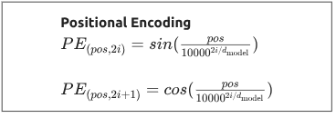
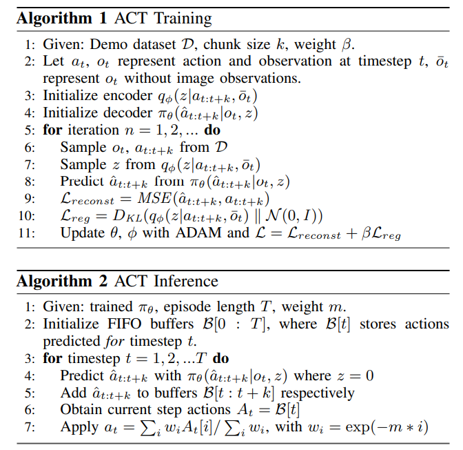
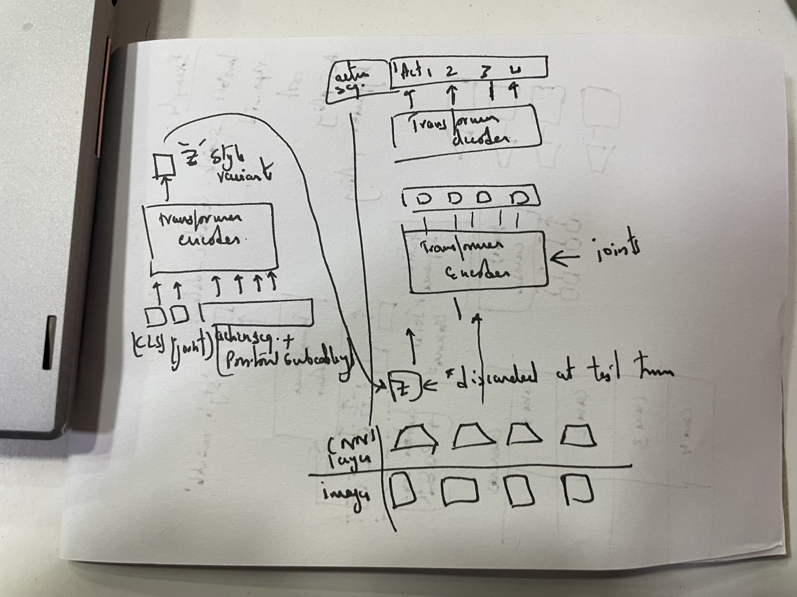
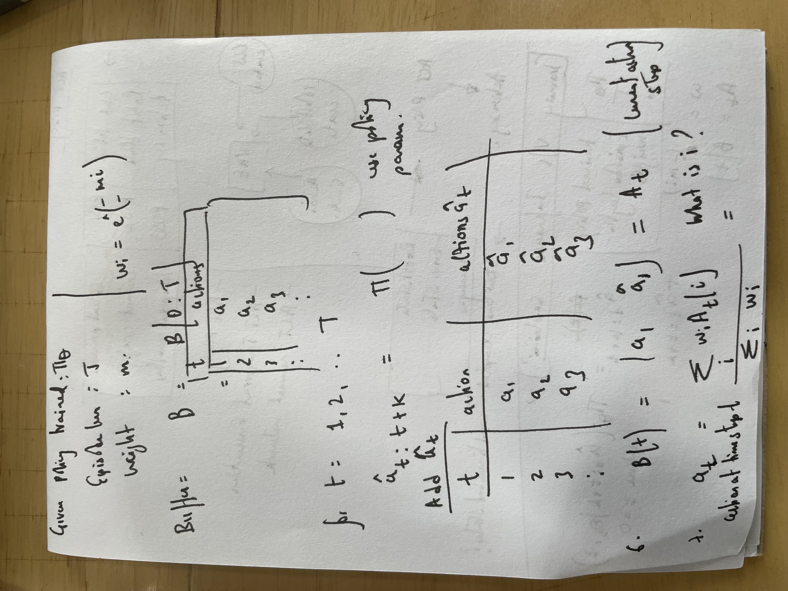

# LeRobot with SVLA SO101 Pick-and-Place Dataset

This repository contains the LeRobot framework along with the SVLA SO101 pick-and-place dataset for robot learning.

## Quick Start

### 1. Download the Dataset

Download the `svla_so101_pickplace` dataset from Hugging Face:

```bash
# Make the download script executable
chmod +x download_svla_dataset.sh

# Run the download script
./download_svla_dataset.sh
```

Available Tasks per Environment:
{'aloha': ['AlohaInsertion-v0', 'AlohaTransferCube-v0'], 'pusht': ['PushT-v0'], 'xarm': ['XarmLift-v0']}

Available Datasets:
['lerobot/aloha_mobile_cabinet', 'lerobot/aloha_mobile_chair', 'lerobot/aloha_mobile_elevator', 'lerobot/aloha_mobile_shrimp', 'lerobot/aloha_mobile_wash_pan', 'lerobot/aloha_mobile_wipe_wine', 'lerobot/aloha_sim_insertion_human', 'lerobot/aloha_sim_insertion_human_image', 'lerobot/aloha_sim_insertion_scripted', 'lerobot/aloha_sim_insertion_scripted_image', 'lerobot/aloha_sim_transfer_cube_human', 'lerobot/aloha_sim_transfer_cube_human_image', 'lerobot/aloha_sim_transfer_cube_scripted', 'lerobot/aloha_sim_transfer_cube_scripted_image', 'lerobot/aloha_static_battery', 'lerobot/aloha_static_candy', 'lerobot/aloha_static_coffee', 'lerobot/aloha_static_coffee_new', 'lerobot/aloha_static_cups_open', 'lerobot/aloha_static_fork_pick_up', 'lerobot/aloha_static_pingpong_test', 'lerobot/aloha_static_pro_pencil', 'lerobot/aloha_static_screw_driver', 'lerobot/aloha_static_tape', 'lerobot/aloha_static_thread_velcro', 'lerobot/aloha_static_towel', 'lerobot/aloha_static_vinh_cup', 'lerobot/aloha_static_vinh_cup_left', 'lerobot/aloha_static_ziploc_slide', 'lerobot/asu_table_top', 'lerobot/austin_buds_dataset', 'lerobot/austin_sailor_dataset', 'lerobot/austin_sirius_dataset', 'lerobot/berkeley_autolab_ur5', 'lerobot/berkeley_cable_routing', 'lerobot/berkeley_fanuc_manipulation', 'lerobot/berkeley_gnm_cory_hall', 'lerobot/berkeley_gnm_recon', 'lerobot/berkeley_gnm_sac_son', 'lerobot/berkeley_mvp', 'lerobot/berkeley_rpt', 'lerobot/cmu_franka_exploration_dataset', 'lerobot/cmu_play_fusion', 'lerobot/cmu_stretch', 'lerobot/columbia_cairlab_pusht_real', 'lerobot/conq_hose_manipulation', 'lerobot/dlr_edan_shared_control', 'lerobot/dlr_sara_grid_clamp', 'lerobot/dlr_sara_pour', 'lerobot/droid_100', 'lerobot/fmb', 'lerobot/iamlab_cmu_pickup_insert', 'lerobot/imperialcollege_sawyer_wrist_cam', 'lerobot/jaco_play', 'lerobot/kaist_nonprehensile', 'lerobot/nyu_door_opening_surprising_effectiveness', 'lerobot/nyu_franka_play_dataset', 'lerobot/nyu_rot_dataset', 'lerobot/pusht', 'lerobot/pusht_image', 'lerobot/roboturk', 'lerobot/stanford_hydra_dataset', 'lerobot/stanford_kuka_multimodal_dataset', 'lerobot/stanford_robocook', 'lerobot/taco_play', 'lerobot/tokyo_u_lsmo', 'lerobot/toto', 'lerobot/ucsd_kitchen_dataset', 'lerobot/ucsd_pick_and_place_dataset', 'lerobot/uiuc_d3field', 'lerobot/umi_cup_in_the_wild', 'lerobot/unitreeh1_fold_clothes', 'lerobot/unitreeh1_rearrange_objects', 'lerobot/unitreeh1_two_robot_greeting', 'lerobot/unitreeh1_warehouse', 'lerobot/usc_cloth_sim', 'lerobot/utaustin_mutex', 'lerobot/utokyo_pr2_opening_fridge', 'lerobot/utokyo_pr2_tabletop_manipulation', 'lerobot/utokyo_saytap', 'lerobot/utokyo_xarm_bimanual', 'lerobot/utokyo_xarm_pick_and_place', 'lerobot/viola', 'lerobot/xarm_lift_medium', 'lerobot/xarm_lift_medium_image', 'lerobot/xarm_lift_medium_replay', 'lerobot/xarm_lift_medium_replay_image', 'lerobot/xarm_push_medium', 'lerobot/xarm_push_medium_image', 'lerobot/xarm_push_medium_replay', 'lerobot/xarm_push_medium_replay_image']

Available Datasets per Environment:
{'aloha': ['lerobot/aloha_sim_insertion_human', 'lerobot/aloha_sim_insertion_scripted', 'lerobot/aloha_sim_transfer_cube_human', 'lerobot/aloha_sim_transfer_cube_scripted', 'lerobot/aloha_sim_insertion_human_image', 'lerobot/aloha_sim_insertion_scripted_image', 'lerobot/aloha_sim_transfer_cube_human_image', 'lerobot/aloha_sim_transfer_cube_scripted_image'], 'pusht': ['lerobot/pusht', 'lerobot/pusht_image'], 'xarm': ['lerobot/xarm_lift_medium', 'lerobot/xarm_lift_medium_replay', 'lerobot/xarm_push_medium', 'lerobot/xarm_push_medium_replay', 'lerobot/xarm_lift_medium_image', 'lerobot/xarm_lift_medium_replay_image', 'lerobot/xarm_push_medium_image', 'lerobot/xarm_push_medium_replay_image']}

Available Real World Datasets:
['lerobot/aloha_mobile_cabinet', 'lerobot/aloha_mobile_chair', 'lerobot/aloha_mobile_elevator', 'lerobot/aloha_mobile_shrimp', 'lerobot/aloha_mobile_wash_pan', 'lerobot/aloha_mobile_wipe_wine', 'lerobot/aloha_static_battery', 'lerobot/aloha_static_candy', 'lerobot/aloha_static_coffee', 'lerobot/aloha_static_coffee_new', 'lerobot/aloha_static_cups_open', 'lerobot/aloha_static_fork_pick_up', 'lerobot/aloha_static_pingpong_test', 'lerobot/aloha_static_pro_pencil', 'lerobot/aloha_static_screw_driver', 'lerobot/aloha_static_tape', 'lerobot/aloha_static_thread_velcro', 'lerobot/aloha_static_towel', 'lerobot/aloha_static_vinh_cup', 'lerobot/aloha_static_vinh_cup_left', 'lerobot/aloha_static_ziploc_slide', 'lerobot/umi_cup_in_the_wild', 'lerobot/unitreeh1_fold_clothes', 'lerobot/unitreeh1_rearrange_objects', 'lerobot/unitreeh1_two_robot_greeting', 'lerobot/unitreeh1_warehouse', 'lerobot/nyu_rot_dataset', 'lerobot/utokyo_saytap', 'lerobot/imperialcollege_sawyer_wrist_cam', 'lerobot/utokyo_xarm_bimanual', 'lerobot/tokyo_u_lsmo', 'lerobot/utokyo_pr2_opening_fridge', 'lerobot/cmu_franka_exploration_dataset', 'lerobot/cmu_stretch', 'lerobot/asu_table_top', 'lerobot/utokyo_pr2_tabletop_manipulation', 'lerobot/utokyo_xarm_pick_and_place', 'lerobot/ucsd_kitchen_dataset', 'lerobot/austin_buds_dataset', 'lerobot/dlr_sara_grid_clamp', 'lerobot/conq_hose_manipulation', 'lerobot/columbia_cairlab_pusht_real', 'lerobot/dlr_sara_pour', 'lerobot/dlr_edan_shared_control', 'lerobot/ucsd_pick_and_place_dataset', 'lerobot/berkeley_cable_routing', 'lerobot/nyu_franka_play_dataset', 'lerobot/austin_sirius_dataset', 'lerobot/cmu_play_fusion', 'lerobot/berkeley_gnm_sac_son', 'lerobot/nyu_door_opening_surprising_effectiveness', 'lerobot/berkeley_fanuc_manipulation', 'lerobot/jaco_play', 'lerobot/viola', 'lerobot/kaist_nonprehensile', 'lerobot/berkeley_mvp', 'lerobot/uiuc_d3field', 'lerobot/berkeley_gnm_recon', 'lerobot/austin_sailor_dataset', 'lerobot/utaustin_mutex', 'lerobot/roboturk', 'lerobot/stanford_hydra_dataset', 'lerobot/berkeley_autolab_ur5', 'lerobot/stanford_robocook', 'lerobot/toto', 'lerobot/fmb', 'lerobot/droid_100', 'lerobot/berkeley_rpt', 'lerobot/stanford_kuka_multimodal_dataset', 'lerobot/iamlab_cmu_pickup_insert', 'lerobot/taco_play', 'lerobot/berkeley_gnm_cory_hall', 'lerobot/usc_cloth_sim']

Available Policies:
['act', 'diffusion', 'tdmpc', 'vqbet']

Available Policies per Environment:
{'aloha': ['act'], 'pusht': ['diffusion', 'vqbet'], 'xarm': ['tdmpc'], 'koch_real': ['act_koch_real'], 'aloha_real': ['act_aloha_real']}

Available Robots:
['koch', 'koch_bimanual', 'aloha', 'so100', 'so101']

Available Cameras:
['opencv', 'intelrealsense']

Available Motors:
['dynamixel', 'feetech']

## Train a policy:

  
  ```
  python -m lerobot.scripts.train \
  --dataset.repo_id=lerobot/svla_so101_pickplace \
  --policy.type=act \
  --output_dir=outputs/train/act_svla_so101 \
  --job_name=act_svla_so101 \
  --policy.device=cuda \
  --wandb.enable=false \
  --policy.push_to_hub=false \
  --batch_size=4 \
  --num_workers=2
```
## Dataset Information

### Dataset Structure

The `svla_so101_pickplace` dataset contains:

- **50 episodes** of pick-and-place demonstrations
- **11,939 total frames** across all episodes
- **30 FPS** recording rate (~6.6 seconds per episode)
- **2 camera views**: upward and side cameras (480x640x3)
- **6-DOF robot arm** with gripper control

### Data Sources

The dataset contains two types of data:

1. **Robot State Data** (from motor encoders):
   - `shoulder_pan.pos` - shoulder pan joint position
   - `shoulder_lift.pos` - shoulder lift joint position  
   - `elbow_flex.pos` - elbow flexion joint position
   - `wrist_flex.pos` - wrist flexion joint position
   - `wrist_roll.pos` - wrist roll joint position
   - `gripper.pos` - gripper position

2. **Video Data** (from cameras):
   - `observation.images.up` - upward camera view
   - `observation.images.side` - side camera view

### Parquet Files

The dataset contains two main parquet files:

1. **Episodes Metadata** (shape: 50, 62):
   - Contains metadata for each episode
   - Episode index, length, task information
   - Start/end timestamps
   - Statistical summaries

2. **Action Data** (shape: 11,939, N):
   - Contains actual time-series data for all frames
   - Robot states, actions, timestamps
   - Video frame references

## Available Environments

- **aloha**: AlohaInsertion-v0, AlohaTransferCube-v0
- **pusht**: PushT-v0  
- **xarm**: XarmLift-v0

## Available Policies

- **act**: Action Chunking Transformer
- **diffusion**: Diffusion-based policies
- **tdmpc**: TD-MPC
- **vqbet**: VQ-BeT

1. Episodes parquet file

Shape: (50, 62) — 50 episodes, 62 fields per episode
Purpose: Contains metadata for each episode, such as:
Episode index
Length (number of frames)
Task index
Start/end timestamps
Statistics (min/max/mean/std for each feature in the episode)
Why 50? There are 50 episodes in the dataset.

2. Action Parquet

Shape: (7, 11939) — data parquet files (in data/chunk-000/) have shape (11939, N), where 11939 is the total number of frames across all episodes.
Purpose: Contains the mapping of task indices to task descriptions, or, if it’s a data parquet, it contains the actual time-series data for all frames.
Why 11939? This is the total number of frames in the dataset (across all episodes)

11939 is the total number of frames in the mp4 files. 
@ 30 fps, 6:37 sec (some extra frames are less than 30, hence less the total is >11910)

Observation state:
from the motor encoders

Action state:
commanded actions

Dataset folder:
https://huggingface.co/datasets/lerobot/svla_so101_pickplace/tree/main/data/chunk-000


## Why is leader used for controlling the torque or force application?

The teleoperation system consists of:

Leader robot: Directly manipulated by a human operator.
Follower robot: Mimics the leader’s movements but is physically interacting with the environment.

The low-level PID controller (Proportional-Integral-Derivative) on the follower robot continuously tries to reduce the error between the leader’s target joint positions and the follower’s current joint positions.

The PID controller calculates a control effort (torque or force) based on the difference bet. q_leader - q_follower

A non-zero difference (error) indicates that the operator is pushing against resistance (e.g., when contacting an object).

The difference signal (leader vs. follower) encodes: Contact forces: Resistance from objects. Human adaptation: The operator pushing harder or easing off.

Similar to transformers, use of embeddings- positional and spatial. Positional embeddings are there to give a transformer knowledge about the position of the input vectors. 



Explaination of Pseudocode:



# KL divergence chosen reason: 

$ L_{reg} = D_{KL}(q_\phi(\tilde{z} | a_{t:t+k}, \tilde{o}_t) || \mathcal{N}(0, I)) $ 

The standard normal distribution $\mathcal{N}(0, I)$ (zero mean, identity covariance) is chosen as the prior because it is a natural distribution that imposes no bias toward any specific direction in the latent space.
In VAEs, the goal is to learn a latent representation $\tilde{z}$ that is both informative (capturing the input data's structure) and generalizable.




## Inference ACT policy


weight m is given calculated as: exp(-temporal_ensemble_coeff * i) where w₀ is the oldest action.

They are then normalized to sum to 1 by dividing by Σwᵢ. 

Here's some intuition around how the coefficient works:
            
- Setting it to 0 uniformly weighs all actions.
- Setting it positive gives more weight to older actions.
- Setting it negative gives more weight to newer actions.
        
NOTE: The default value for `temporal_ensemble_coeff` used by the original ACT work is 0.01.

Multimodality in ACT policy: 
- Robot State - Joint positions, velocities, end-effector pose
- Environment State - Object positions, task-specific features
- Visual Observations - Camera images from multiple viewpoints
- Action Sequences - Target joint trajectories (for VAE training)

For image analysis and classification, a RESNET layer is used:
Typical layers in RESNET and feature map:
conv1 → bn1 → relu → maxpool → layer1 → layer2 → layer3 → layer4 → avgpool → fc

At layer 4, the RESNET model is intercepted (minus the classifier). This is done using the Intermediate layer getter.

```
self.backbone = IntermediateLayerGetter(backbone_model, return_layers={"layer4": "feature_map"})
```

# len (RESNET).output classifier = 1000

The input embeddings are 
- CLS token given as 
```            
self.vae_encoder_cls_embed = nn.Embedding(1, config.dim_model)
```
Acts as a "summary token" that will encode the latent distribution parameters. This embedding is learnt during training

- Robot state embeddings :  Maps robot state (joint positions, velocities, etc.) to transformer dimension

If robot has 7 joints → Linear(7, 512)

```
            # Projection layer for joint-space configuration to hidden dimension.
            if self.config.robot_state_feature:
                self.vae_encoder_robot_state_input_proj = nn.Linear(
                    self.config.robot_state_feature.shape[0], config.dim_model
                )
```

- Action sequence []

Purpose: Maps each action in the sequence to transformer dimension
Example: If action is 7-dimensional → Linear(7, 512)

```
            action_embed = self.vae_encoder_action_input_proj(batch["action"])  # (B, S, D)
```

- combining embeddings
```
            if self.config.robot_state_feature:
                vae_encoder_input = [cls_embed, robot_state_embed, action_embed]  # (B, S+2, D)
            else:
                vae_encoder_input = [cls_embed, action_embed]
            vae_encoder_input = torch.cat(vae_encoder_input, axis=1)
```
1. Create list: [cls_embed, robot_state_embed, action_embed]
2. Concatenate along sequence dimension: torch.cat(..., axis=1)

